# Turno Enlace - App de Citas Médicas


## Descripción

**Turno Enlace** es una aplicación móvil desarrollada en React Native con Expo que permite a los usuarios gestionar citas médicas de forma segura y eficiente. La aplicación integra autenticación Firebase, almacenamiento seguro de datos y consumo de APIs externas para proporcionar información climática.

## Características Principales

- 🔐 **Autenticación Segura**: Login y registro con Firebase Authentication
- 🔒 **Almacenamiento Cifrado**: Datos sensibles protegidos con Expo SecureStore
- 🌤️ **Integración de APIs**: Consumo de OpenWeather API para información climática
- 📂 **Gestión de Citas**: CRUD completo para administrar citas médicas
- 📂 **Gestión de Categorías**: CRUD completo para organizar categorías de citas
- 📱 **Diseño Responsivo**: Interfaz optimizada para dispositivos móviles
- 🛡️ **Seguridad Avanzada**: Implementación de mejores prácticas de seguridad móvil
- ✅ **Testing Completo**: Pruebas unitarias y de integración con Jest

## Tecnologías Utilizadas

### Core Framework

- **React Native**: 0.81.4
- **Expo**: ~54.0.8
- **TypeScript**: ~5.9.2

### Autenticación y Seguridad

- **Firebase**: ^12.3.0 (Authentication)
- **Expo SecureStore**: ~15.0.7 (Almacenamiento cifrado)

### Navegación y UI

- **Expo Router**: ~6.0.6
- **React Navigation**: ^7.1.8
- **Expo Vector Icons**: ^15.0.2

### Formularios y Validación

- **React Hook Form**: ^7.62.0
- **Zod**: ^3.25.76
- **@hookform/resolvers**: ^5.2.2

### APIs Externas

- **OpenWeather API**: Información meteorológica en tiempo real

## Capturas de Pantalla

### Flujo de Autenticación

<div align="left">
  
  
  
  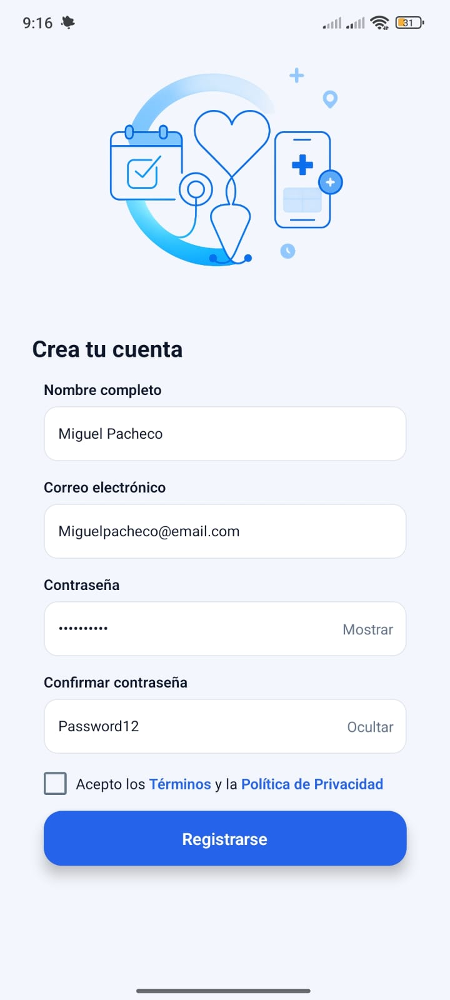
  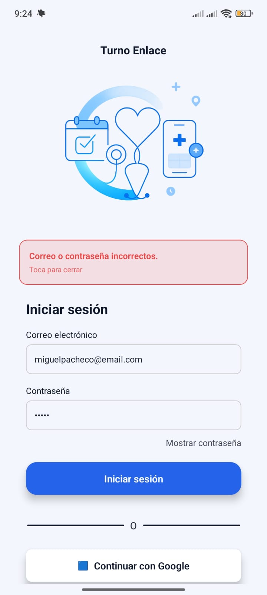
</div>

### Pantalla Principal con Integración de Clima

<div align="left">
  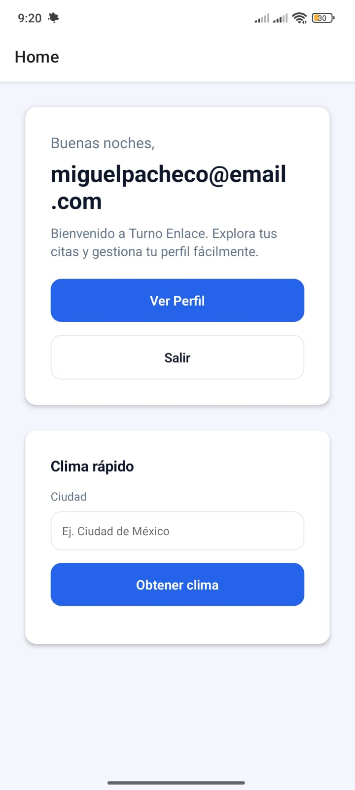
</div>

### Funcionalidades

### 🌤️ Información Climática

<div align="left">
  
  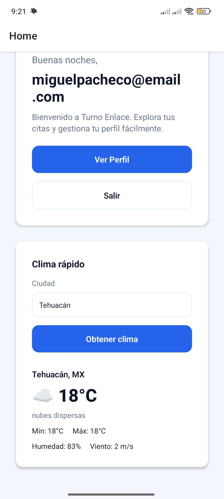
</div>

### 👤 Perfil de Usuario

<div align="left">
 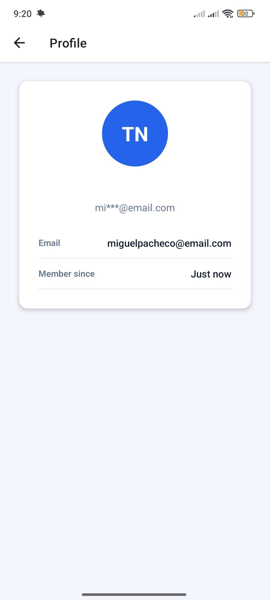
</div>

### 📂 CRUD de Categorías

<div align="left">
 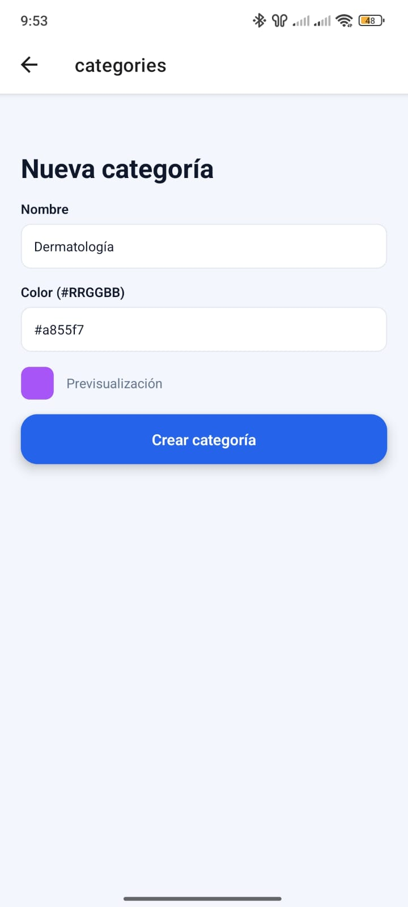
 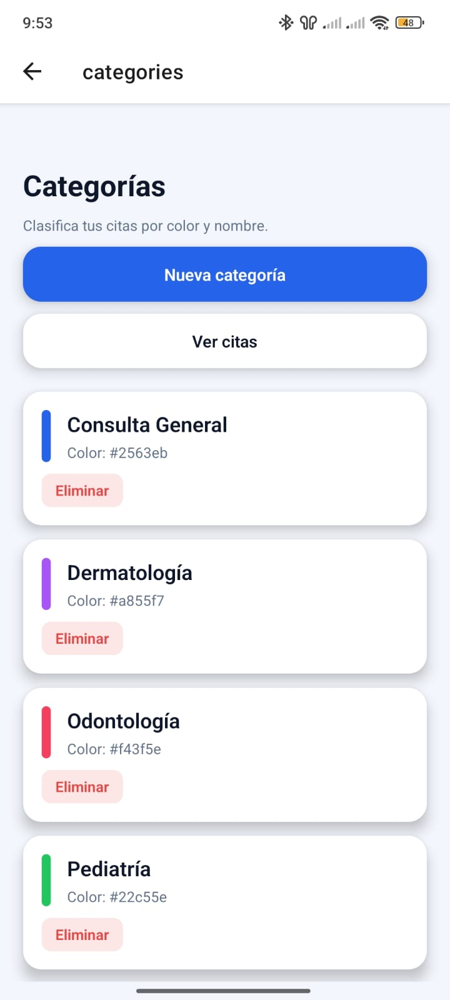
 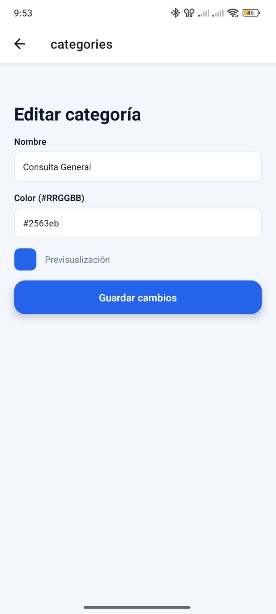
 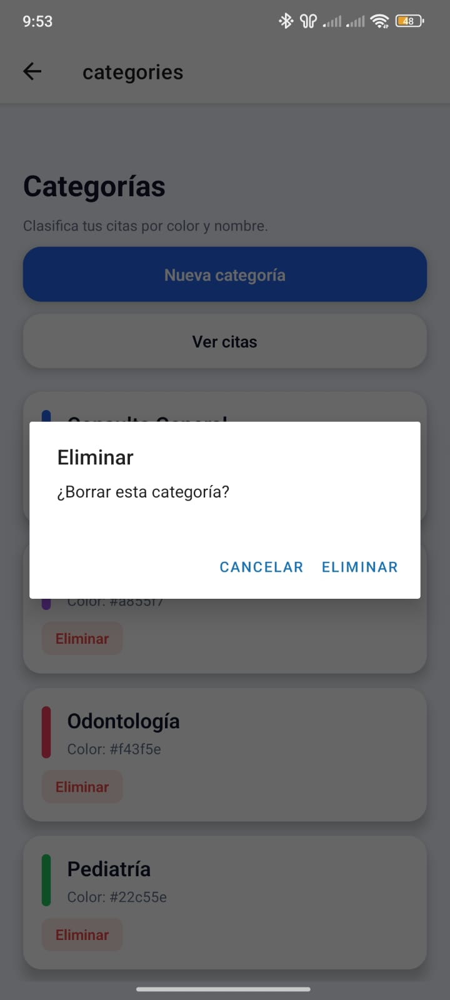
 
</div>

### 📅 CRUD de Citas

<div align="left">
 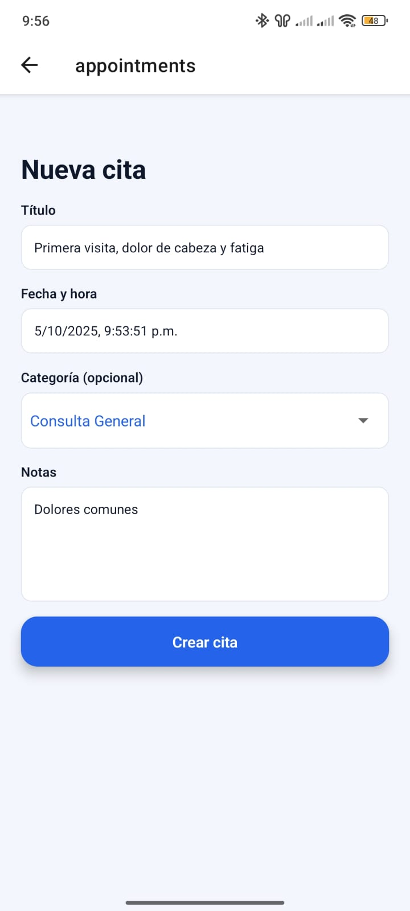
 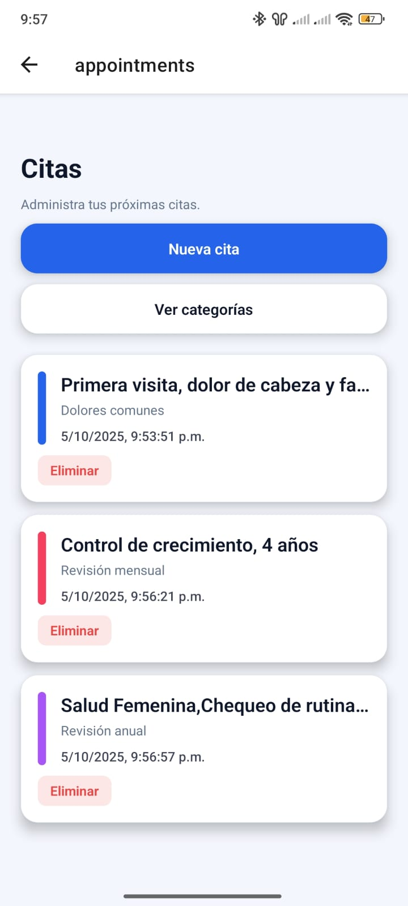
 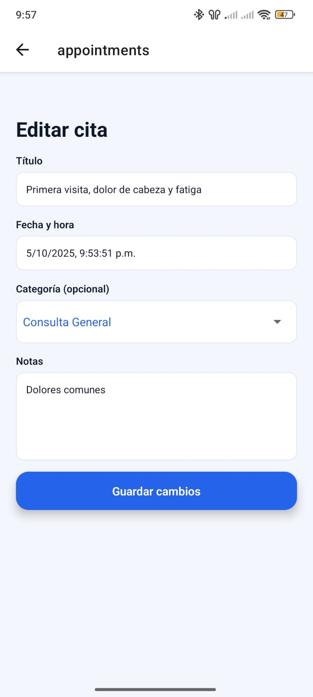
 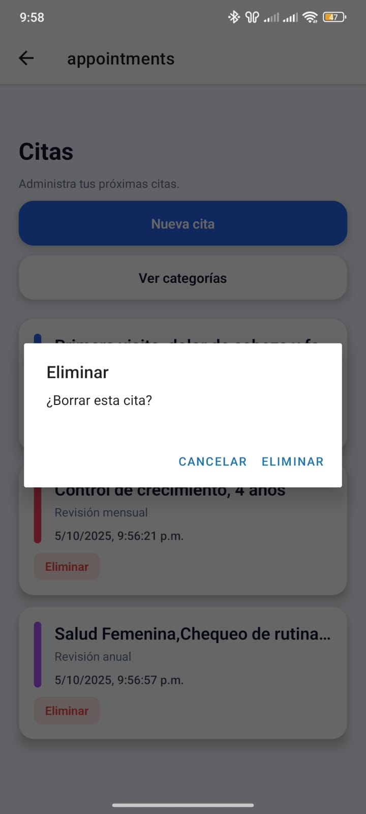
 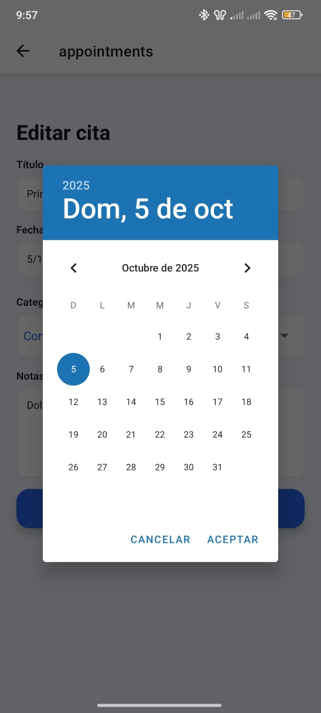
</div>

## Instalación y Configuración

### Prerrequisitos

- Node.js (versión 16 o superior)
- npm o yarn
- Expo CLI: `npm install -g @expo/cli`
- Cuenta de Firebase configurada
- API Key de OpenWeather

### Pasos de Instalación

1. **Clonar el repositorio**

   ```bash
   git clone https://github.com/Alfre33/app-turno-enlace.git
   cd app-turno-enlace
   ```

2. **Instalar dependencias**

   ```bash
   npm install
   # o
   yarn install
   ```

3. **Configurar variables de entorno**

- Clonar el archivo `.env.example` que se encuentra en la raíz del proyecto
- Renombrar el archivo `.env.example` --> `.env` en la raíz del proyecto
- Llenar cada variable de entorno
  ```env
  EXPO_PUBLIC_OPENWEATHER_API_KEY=tu_api_key_aqui
  EXPO_PUBLIC_OPENWEATHER_URL=tu_api_key_aqu
  EXPO_PUBLIC_FIREBASE_API_KEY=tu_api_key_aqu
  EXPO_PUBLIC_FIREBASE_AUTH_DOMAIN=tu_api_key_aqu
  EXPO_PUBLIC_FIREBASE_PROJECT_ID=tu_api_key_aqu
  EXPO_PUBLIC_FIREBASE_STORAGE_BUCKET=tu_api_key_aqu
  EXPO_PUBLIC_FIREBASE_MESSAGIN_SENDER_ID=tu_api_key_aqu
  EXPO_PUBLIC_FIREBASE_APP_ID=tu_api_key_aqu
  ```

4. **Ejecutar la aplicación**

   ```bash
   # Desarrollo
   npm start

   # Android
   npm run android

   # iOS
   npm run ios

   # Web
   npm run web
   ```

## Estructura del Proyecto

```
app-turno-enlace/
├── app/                        # Rutas y pantallas principales
│   ├── (app)/                 # Pantallas autenticadas
│   │   ├── index.tsx         # Pantalla principal con clima
│   │   ├── profile.tsx       # Pantalla de perfil
│   │   ├── weather.tsx       # Pantalla de clima
│   │   ├── appointments/     # CRUD de citas
│   │   │   ├── index.tsx    # Lista de citas
│   │   │   └── [id].tsx     # Detalle/edición de cita
│   │   └── categories/       # CRUD de categorías
│   │       ├── index.tsx    # Lista de categorías
│   │       └── [id].tsx     # Detalle/edición de categoría
│   ├── (auth)/               # Pantallas de autenticación
│   │   ├── login.tsx         # Pantalla de inicio de sesión
│   │   ├── register.tsx      # Pantalla de registro
│   │   └── welcome.tsx       # Pantalla de bienvenida
│   └── _layout.tsx           # Layout principal con guards
├── src/
│   ├── services/             # Servicios de datos
│   │   ├── appointmentsService.ts  # CRUD de citas
│   │   ├── categoriesService.ts    # CRUD de categorías
│   │   └── authService.ts          # Autenticación
│   ├── libs/                 # Librerías y configuraciones
│   │   ├── firebase.ts       # Configuración de Firebase
│   │   ├── openweather.ts    # Cliente de OpenWeather
│   │   └── http.ts           # Cliente HTTP
│   └── types/                # Tipos TypeScript
│       └── models.ts         # Modelos de datos
├── contexts/                  # Context providers
│   ├── AuthContext.tsx       # Context de autenticación
│   └── ThemeContext.tsx      # Context de temas
├── __tests__/                # Pruebas unitarias
│   ├── appointments.service.test.ts
│   ├── categories.service.test.ts
│   ├── login.test.tsx
│   ├── register.test.tsx
│   └── openweather.test.ts
├── __mocks__/                # Mocks para testing
├── constants/                # Constantes y configuraciones
├── hooks/                    # Custom hooks
├── components/               # Componentes reutilizables
├── .env                      # Variables de entorno (no incluido)
├── jest.config.js           # Configuración de Jest
├── app.config.ts            # Configuración de Expo
└── package.json
```

## Funcionalidades CRUD

### Gestión de Categorías

La aplicación permite crear, leer, actualizar y eliminar categorías para organizar las citas médicas:

```typescript
// Servicios disponibles
- getCategories(): Obtener todas las categorías
- subscribeToCategories(callback): Suscripción en tiempo real
- createCategory(data): Crear nueva categoría
- updateCategory(id, data): Actualizar categoría existente
- deleteCategory(id): Eliminar categoría
```

**Características:**

- 📂 Lista de categorías con colores personalizados
- ➕ Crear nuevas categorías
- ✏️ Editar categorías existentes
- 🗑️ Eliminar categorías
- 🔄 Sincronización en tiempo real con Firebase

### Gestión de Citas

La aplicación permite administrar citas médicas de forma completa:

```typescript
// Servicios disponibles
- getAppointments(): Obtener todas las citas
- subscribeToAppointments(callback): Suscripción en tiempo real
- createAppointment(data): Crear nueva cita
- updateAppointment(id, data): Actualizar cita existente
- deleteAppointment(id): Eliminar cita
```

**Características:**

- 📅 Lista de citas organizadas por fecha
- ➕ Crear nuevas citas con categoría
- ✏️ Editar citas existentes
- 🗑️ Eliminar citas
- 🔄 Sincronización en tiempo real con Firebase
- 🏷️ Asociación con categorías

## Integración de APIs

### Firebase Authentication

La aplicación utiliza Firebase Auth para manejo seguro de usuarios:

```typescript
// Login de usuario
const login = async ({ email, password, remember }) => {
  try {
    await signInWithEmailAndPassword(auth, email, password);
    if (remember) {
      await SecureStore.setItemAsync("remember", "1");
    }
  } catch (error) {
    // Manejo de errores
  }
};
```

### Firebase Firestore

Almacenamiento y sincronización de datos en tiempo real:

```typescript
// Ejemplo: Suscripción a cambios en citas
const subscribeToAppointments = (
  onUpdate: (appointments: Appointment[]) => void
) => {
  const q = query(collection(db, "appointments"), orderBy("date", "desc"));

  return onSnapshot(q, (snapshot) => {
    const appointments = snapshot.docs.map((doc) => ({
      id: doc.id,
      ...doc.data(),
    }));
    onUpdate(appointments);
  });
};
```

### OpenWeather API

Consumo de datos meteorológicos con validación de errores:

```typescript
// Obtener datos del clima
const fetchWeather = async () => {
  const url = `${OW_BASE}/weather?q=${city}&appid=${API_KEY}&units=metric&lang=es`;

  const response = await fetch(url, {
    signal: abortController.signal,
  });

  if (!response.ok) {
    throw new Error(`HTTP ${response.status}`);
  }

  const data = await response.json();
  return data;
};
```

## Características de Seguridad

### 1. Autenticación(FIREBASE AUTH)

- Login/registro con Firebase Auth
- Verificación de email automática
- Gestión de sesiones segura
- Protección contra ataques de fuerza bruta

### 2. Almacenamiento Seguro(EXPO SECURESTORE)

- **Expo SecureStore** para datos sensibles
- Cifrado nativo (iOS Keychain / Android Keystore)
- Limpieza automática al cerrar sesión

### 3. Validación de Datos(ZOD)

- Sanitización de entradas de usuario
- Validación de formatos (email, API keys)
- Manejo seguro de errores

### 4. Comunicaciones

- HTTPS obligatorio para todas las APIs
- Timeouts configurados
- Validación de respuestas

## Scripts Disponibles

```json
{
  "start": "expo start",
  "android": "expo start --android",
  "ios": "expo start --ios",
  "web": "expo start --web",
  "lint": "expo lint",
  "test": "jest"
}
```

## Testing

La aplicación incluye una suite completa de pruebas para garantizar la calidad del código y la funcionalidad de los componentes.

### Ejecutar Pruebas

```bash
# Ejecutar todas las pruebas
npm run test

# Ejecutar pruebas en modo watch
npx jest --watch

# Ejecutar pruebas con cobertura
npx jest --coverage

# Ejecutar un archivo de prueba específico
npx jest __tests__/appointments.service.test.ts

# Ejecutar pruebas con salida detallada
npx jest --verbose
```

### Cobertura de Pruebas

El proyecto incluye las siguientes pruebas:

#### Servicios

- ✅ **Appointments Service**: Pruebas de CRUD de citas
  - `getAppointments()`: Obtiene todas las citas
  - `subscribeToAppointments()`: Suscripción en tiempo real
- ✅ **Categories Service**: Pruebas de CRUD de categorías
  - `getCategories()`: Obtiene todas las categorías
  - `subscribeToCategories()`: Suscripción en tiempo real

#### Autenticación

- ✅ **Login**: Validación de esquemas y componente
- ✅ **Register**: Validación de esquemas y componente
- ✅ **useAuth Hook**: Pruebas del hook de autenticación

#### Integraciones

- ✅ **OpenWeather Core**: Funciones auxiliares
  - `iconToEmoji()`: Conversión de códigos a emojis
  - `buildWeatherUrl()`: Construcción de URLs
- ✅ **OpenWeather API**: Integración completa
  - `getCurrentWeatherByCity()`: Obtención de datos climáticos
  - Validación de API key

### Capturas de Pruebas

<!-- Agregar captura de pantalla de la ejecución de pruebas -->
<div align="left">
  <sub><b>🧪 Ejecución de Pruebas</b></sub>
</div>

<!-- Agregar captura de pantalla del reporte de cobertura -->
<div align="left">
  <sub><b>📊 Reporte de Cobertura</b></sub>
</div>

## Dependencias Principales

### Producción

```json
{
  "expo": "~54.0.8",
  "react": "19.1.0",
  "react-native": "0.81.4",
  "firebase": "^12.3.0",
  "expo-secure-store": "~15.0.7",
  "expo-router": "~6.0.6",
  "react-hook-form": "^7.62.0",
  "zod": "^3.25.76"
}
```

### Desarrollo

```json
{
  "@types/react": "~19.1.0",
  "typescript": "~5.9.2",
  "eslint": "^9.25.0",
  "eslint-config-expo": "~10.0.0"
}
```

## Configuración de Firebase

1. Crear proyecto en [Firebase Console](https://console.firebase.google.com/)
2. Habilitar Authentication con Email/Password
3. Configurar dominio autorizado
4. Crear una app web

<div align="left">
  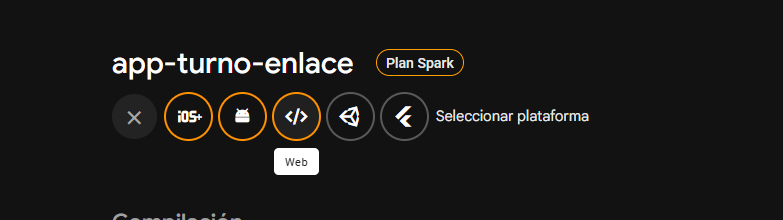
</div>

5. Llenar las variables de entorno en el archivo `.env`
6. Activar firestore
7. Crear reglas de firestore

```typescript

  rules_version = '2';
service cloud.firestore {
  match /databases/{database}/documents {
    function isSignedIn() { return request.auth != null; }

    // Colección de categorías
    match /categories/{id} {
      allow read, write: if isSignedIn();
    }

    // Colección de citas
    match /appointments/{id} {
      allow read, write: if isSignedIn();
    }

    // (Opcional) cualquier otra colección autenticada
    match /{document=**} {
      allow read, write: if isSignedIn();
    }
  }
}
```

## Configuración de OpenWeather

1. Registrarse en [OpenWeather](https://openweathermap.org/api)
2. Obtener API Key gratuita
3. Llenar las variables de entorno en el archivo `.env`

## Desarrollo y Contribución

### Estructura de Branches

- `main`: Rama principal (producción)
- `develop`: Rama de desarrollo
- `feature/*`: Nuevas características

### Estándares de Código

- TypeScript estricto
- ESLint con configuración Expo
- Prettier para formateo
- Conventional Commits

## Seguridad y Mejores Prácticas

Ver [SECURITY.md](./SECURITY.md) para documentación detallada de seguridad.

### Resumen de Medidas de Seguridad:

- 🔐 Firebase Authentication integrado
- 🔒 SecureStore para datos sensibles
- 🌐 HTTPS para todas las comunicaciones
- ✅ Validación estricta de datos
- 🛡️ Manejo seguro de errores
- 📱 Guards de navegación por autenticación

## FAQ

**Q: ¿Cómo obtengo una API key de OpenWeather?**
A: Registrate en openweathermap.org, confirma tu email y copia la API key gratuita.

**Q: ¿La aplicación funciona offline?**
A: La autenticación requiere conexión. Los datos del clima se cachean temporalmente.

**Q: ¿Puedo usar otros proveedores de autenticación?**
A: Sí, Firebase Auth soporta Google, Facebook, Apple, etc. Requiere configuración adicional.

**Q: ¿Dónde se almacenan los datos sensibles?**
A: En SecureStore (iOS Keychain/Android Keystore), nunca en texto plano.

## Licencia

Este proyecto está bajo la Licencia MIT. Ver [LICENSE](./LICENSE) para más detalles.

## Contacto y Soporte

- **Repositorio**: [GitHub](https://github.com/AlonsoMarcos683/Citas-Medicas)
- **Issues**: [GitHub Issues](https://github.com/AlonsoMarcos683/Citas-Medicas/issues)

## Roadmap

### Version 1.1 (Completado) ✅

- [x] Gestión completa de citas médicas (CRUD)
- [x] Gestión de categorías (CRUD)
- [x] Sincronización en tiempo real con Firebase
- [x] Suite de pruebas con Jest
- [x] Integración con Firebase Firestore

### Version 1.2 (Próximamente)

- [ ] Calendario de citas integrado
- [ ] Notificaciones push
- [ ] Perfil de usuario extendido
- [ ] Filtros y búsqueda de citas

### Version 1.3

- [ ] Modo offline mejorado
- [ ] Soporte multi-idioma
- [ ] Temas personalizables
- [ ] Exportación de datos

---

**Turno Enlace** - Desarrollado con ❤️ usando React Native, Expo y Firebase
